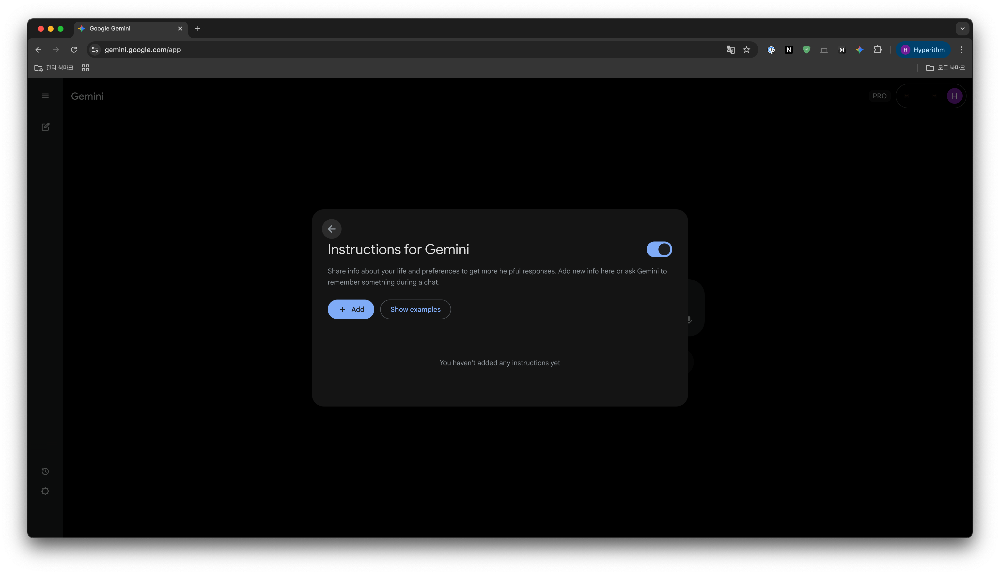

# Gemini 지침 확장 프로그램

Google Gemini에 나만의 지침을 추가하는 Chrome 확장 프로그램입니다.

<table>
  <tr>
    <td></td>
    <td></td>
  </tr>
  <tr>
    <td align="center"><i>설정 메뉴에서 "Gemini 지침" 선택</i></td>
    <td align="center"><i>지침 추가/관리 화면</i></td>
  </tr>
</table>

## 이런 분들께 추천해요

- Gemini에게 매번 같은 말 반복하기 귀찮으신 분
- "항상 한국어로 답해줘" 같은 기본 지침을 설정하고 싶으신 분
- 나만의 응답 스타일을 Gemini에게 가르치고 싶으신 분

## 주요 기능

- 새 대화 시작할 때 자동으로 지침 추가
- Gemini 설정 메뉴에서 바로 관리
- 여러 개의 지침 등록 가능
- 한국어/영어 지원

## 설치 방법

### 1단계: 다운로드

[**📥 최신 버전 다운로드**](https://github.com/hyperithm-public/gemini-system-prompt-ext/releases/latest)

위 링크에서 `extension.zip` 파일을 다운로드하고 압축을 풉니다.

### 2단계: Chrome 확장 프로그램 페이지 열기

Chrome 주소창에 입력:
```
chrome://extensions
```

우측 상단의 **개발자 모드**를 켭니다.

### 3단계: 확장 프로그램 설치

1. **압축해제된 확장 프로그램을 로드합니다** 클릭
2. 압축 해제한 폴더 선택
3. 완료!

## 사용 방법

1. [gemini.google.com](https://gemini.google.com) 접속
2. 우측 상단 설정 메뉴 클릭
3. **Gemini 지침** 메뉴 선택
4. 원하는 지침 추가

### 지침 예시

- "항상 친근하게 반말로 대답해줘"
- "코드 작성할 때 주석을 꼭 달아줘"
- "답변은 간결하게 해줘"
- "나는 Python 개발자야"

## 작동 원리

새 대화를 시작하면 첫 번째 메시지에 등록한 지침이 자동으로 추가됩니다. 같은 대화 내에서는 한 번만 추가되고, 새 대화를 시작하면 다시 추가됩니다.

## 문제가 생겼나요?

1. `chrome://extensions`에서 확장 프로그램이 켜져있는지 확인
2. Gemini 페이지 새로고침 (F5)
3. 확장 프로그램 새로고침 버튼 클릭

## 라이선스

MIT License
